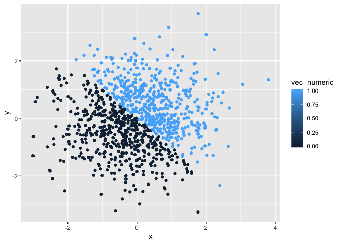

p8105 homework1
================
Shuwei Liu sl4471
2018-09-19

This is the first homework for p8105.

Problem 1
=========

1.1 Create a data frame
-----------------------

First, create a data frame containing four variables as the problem 1 asked.

``` r
set.seed(1)

hw1_df = tibble(
  vec_numeric = runif(10, min = 0, max = 5),
  vec_logical = vec_numeric > 2,
  vec_char = c("hello", "data", "science", "my", "friend", "I", "can", "figure", "it", "out"),
  vec_factor = factor(c("apple", "banana", "orange", "grape", "peach", "lemon", "stawberry", "blueberry", "pear", "watermelon"))
)
```

We can view the data frame here.

    ## # A tibble: 10 x 4
    ##    vec_numeric vec_logical vec_char vec_factor
    ##          <dbl> <lgl>       <chr>    <fct>     
    ##  1       1.33  FALSE       hello    apple     
    ##  2       1.86  FALSE       data     banana    
    ##  3       2.86  TRUE        science  orange    
    ##  4       4.54  TRUE        my       grape     
    ##  5       1.01  FALSE       friend   peach     
    ##  6       4.49  TRUE        I        lemon     
    ##  7       4.72  TRUE        can      stawberry 
    ##  8       3.30  TRUE        figure   blueberry 
    ##  9       3.15  TRUE        it       pear      
    ## 10       0.309 FALSE       out      watermelon

1.2 Take the mean of variables
------------------------------

Next, I'll try to take the mean of each variables.

The mean of variables "vec\_numeric" is 2.7575694. The mean of variables "vec\_logical" is 0.6. The mean of variables "vec\_char" is NA. The mean of variables "vec\_factor" is NA.

As above, obviously, only the variable "vec\_numeric" and "vec\_logical" have mean since the other variables are words that cannot be calculated.

1.3 Apply the "as." function to the other variables
---------------------------------------------------

``` r
as.numeric(hw1_df$vec_logical)
as.numeric(hw1_df$vec_char)
as.numeric(hw1_df$vec_factor)
```

As we can observe, the logical variable and the factor variable can be coverted and displayed in numerical format. However, the character variable cannot be coerced since it cannot be classified as the other two do. "0" and "1" can replace "false" and "true" messege in the logical variable while the content in factor variable can be placed into 10 different types and displayed in 10 numbers.

``` r
as.character(hw1_df$vec_char)
as.numeric(hw1_df$vec_char)
as.factor(hw1_df$vec_char)
as.logical(hw1_df$vec_char)
```

The character variable can be converted into factor variable and be placed in a sequence as it has different levels. But it cannot be converted into numeric or logical variable since it does not contain numbers and it cannot be classified into two types either.

``` r
as.factor(hw1_df$vec_factor)
as.numeric(hw1_df$vec_factor)
as.character(hw1_df$vec_factor)
as.logical(hw1_df$vec_factor)
```

Similarly, the factor variable cannot be classified into two types, as a result, it cannot be converted into logical variable. It can be converted into numeric variable and shown in numbers according to the alphabetic order. It can also be converted into character variable since it is exactly a group of words.

Prblem 2
========

2.1 Create a data frame
-----------------------

``` r
set.seed(1)

hw2_df = tibble(
  x = rnorm(1000),
  y = rnorm(1000),
  vec_logical = x + y > 0,
  vec_numeric = as.numeric(vec_logical),
  vec_factor = as.factor(vec_logical)
)
```

The size of the dataset is *1000, 5*. The mean of the sample is *-0.0116481*. The median of the sample is *-0.0353242*. The proportion of cases for which the logical vector is true *0.49*.

2.2 Make scatterplots
---------------------

**The color of the first scatterplot points using the logical variable.**

``` r
ggplot(hw2_df, aes(x = x, y = y, color = vec_logical)) + geom_point()
```


``` r
ggsave("hw1_df2_plot_1.pdf", path = "./")
```

    ## Saving 7 x 5 in image

**The color of the second scatterplot points using the numeric variable.**

``` r
ggplot(hw2_df, aes(x = x, y = y, color = vec_numeric)) + geom_point()
```



**The color of the third scatterplot points using the factor variable.**

``` r
ggplot(hw2_df, aes(x = x, y = y, color = vec_factor)) + geom_point()
```


As we can see in the plots, the boundary line of two different colors is *y = x*. Above the line are the points that *x + y &gt; 0*, while below the line are those *x + y &lt; 0*. Since both the numeric vector and factor vector are created by coercing the logical vector, all the three scatterplots share the same boundary line.
